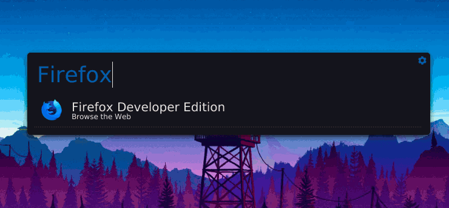

# Walbert



## Use [PyWal](https://github.com/dylanaraps/pywal)  color schemes in your [Albert Launcher](https://github.com/albertlauncher/albert).

### Still a work in progress

## Usage 
- Copy the Walbert.qss file included in this repo into this directory
```
/usr/share/albert/org.albert.frontend.widgetboxmodel/themes/
```

- Open Settings and change Albert's current theme to ```Walbert``` and Frontend to ```Widget Box Model```

- Execute the script
```
python walbert.py
```

- Restart Albert/Change theme to something else and back to Walbert

- Enjoy !

## Contribution

You're more than welcome to submit me your pull requests to make this script even better and easier to use !
